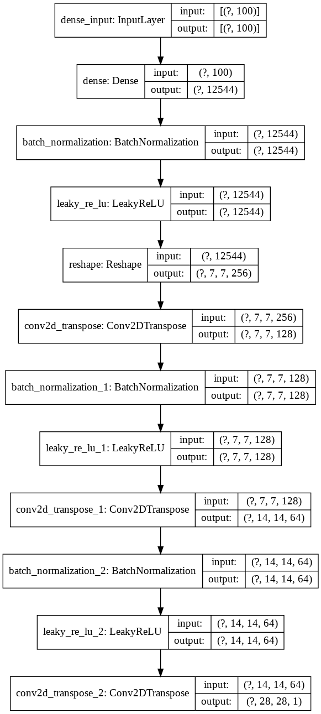
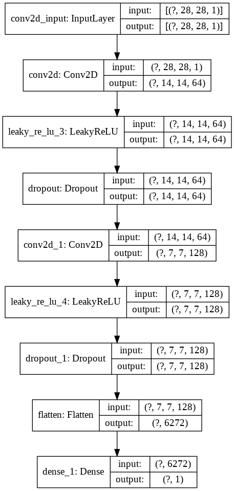

# GAN Assignments
## 1. [2020.1.16] GAN 예제
MNIST 데이터셋과 DCGAN으로 숫자 이미지 생성하기

TensorFlow 튜토리얼의 [심층 합성곱 생성적 적대 신경망](https://www.tensorflow.org/tutorials/generative/dcgan)을 참고하였습니다.

### 생성자(좌)와 감별자(우) 모델

</img>

</img>

### 학습 결과물

