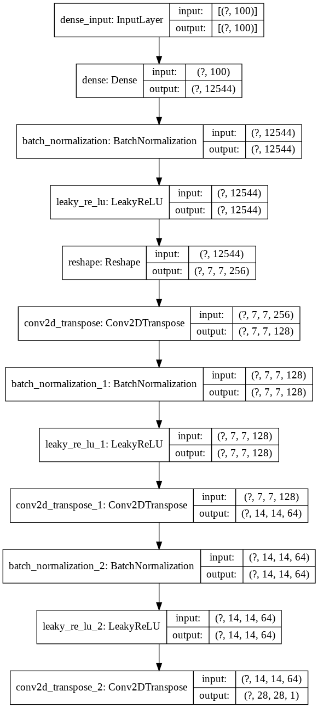
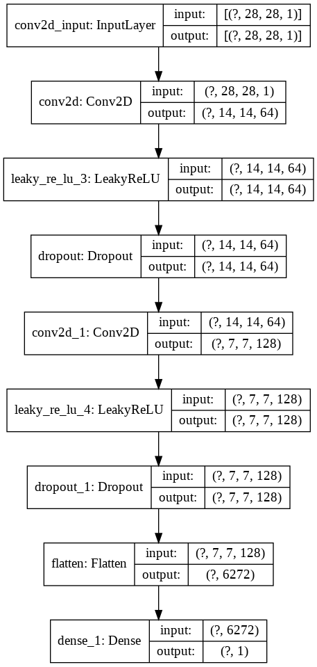

# [2020.1.16] MNIST 데이터셋과 DCGAN으로 숫자 이미지 생성하기

TensorFlow 튜토리얼의 [심층 합성곱 생성적 적대 신경망](https://www.tensorflow.org/tutorials/generative/dcgan)을 참고하였습니다.

## 생성자와 감별자 모델

| 생성자 모델 | 감별자 모델 |
| ----------- | ----------- |
| </img> | </img> |

## 학습 결과물

